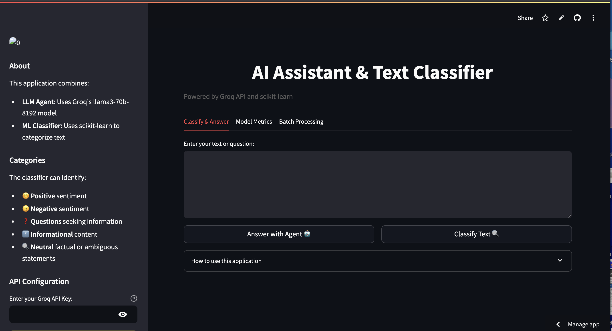
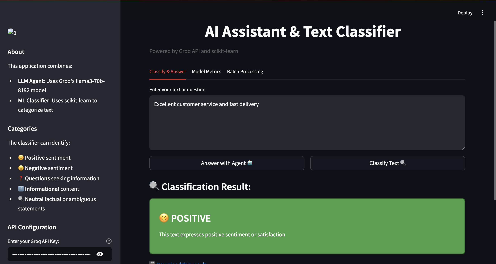
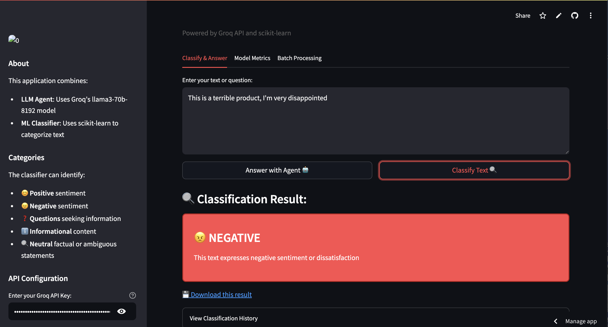

# ⏱️ 1-Hour AI Challenge: Groq Classifier

<div align="center">


**A full-stack AI application built in under 60 minutes using Cursor AI**

</div>

## 🚀 The Sub-60 Minute Challenge

<div align="center">
<table><tr><td>
<h3>⏱️ Can we build a complete, production-ready AI application in under 60 minutes?</h3>
</td></tr></table>
</div>

This project was created as a speed-coding challenge to test the limits of AI-assisted development. With only **Cursor AI** as a development tool and a strict time limit of **60 minutes**, the goal was to build a fully-functional application that combines:

- 🤖 A LangChain-powered LLM chatbot using Groq API
- 🧠 A scikit-learn ML classifier with multiple categories
- 📊 Data visualization and analytics
- 📱 A polished, user-friendly interface
- ✅ Complete with tests and documentation

**The result?** A complete, production-ready application built in less than one hour of pure development time. This challenge demonstrates how modern AI-powered development tools are revolutionizing the software development lifecycle.

## 🎮 Live Demo

Try the application live on Streamlit Cloud:
[**Groq Classifier App**](https://groq-classifier-ay4byyvdhkb5seeiatpbnt.streamlit.app/) 

<div align="center">
  
  <p><em>The Groq Classifier interface with text classification and LLM capabilities</em></p>
</div>

## ✨ What Was Built in Under 60 Minutes

The challenge produced a surprisingly complete application with:

### 🧠 Core AI Features
- **LLM Agent**: Enterprise-grade question answering using Groq's llama3-70b-8192 model
- **Text Classification**: Multi-category ML classifier using scikit-learn
- **Sentiment Analysis**: Positive/negative sentiment detection
- **Question Recognition**: Automatic detection of questions
- **Confidence Scoring**: Uncertainty detection for low-confidence predictions
- **Model Persistence**: Save and load trained models for faster inference
- **Cross-Validation**: Evaluate model performance with proper metrics

### 📊 Data & Analytics
- **Interactive Dashboard**: Visual analytics of classification results
- **Batch Processing**: Process multiple texts at once
- **Data Export**: Save and analyze classification results
- **Classifier Statistics**: Visual insights into the ML model
- **Performance Metrics**: View detailed model performance metrics by category
- **CSV Upload**: Upload CSV files for batch processing

### 🛠️ Technical Features
- **Direct API Integration**: Enter Groq API key directly in the interface
- **Clean Architecture**: Well-structured, modular codebase
- **API Examples**: Programmatic usage documentation
- **Automated Tests**: Unit tests for all components
- **Comprehensive Docs**: Full documentation of all features
- **Tabbed Interface**: Organized functionality in intuitive tabs

## 🔍 Classification Categories

The classifier can instantly identify five different types of text:

- 😊 **Positive**: Identifies positive sentiment in text
- 😠 **Negative**: Identifies negative sentiment in text
- ❓ **Questions**: Identifies queries seeking information
- ℹ️ **Informational**: Identifies factual statements
- 🔍 **Neutral**: Identifies neutral or ambiguous statements

<div align="center">
  
  <p><em>Example of positive sentiment classification detection</em></p>
</div>

## ⚙️ Tech Stack Built in 60 Minutes

| Category | Technologies |
|----------|-------------|
| **AI & ML** | [LangChain](https://langchain.com/), [Groq API](https://groq.com/), [scikit-learn](https://scikit-learn.org/) |
| **Frontend** | [Streamlit](https://streamlit.io/), HTML, CSS |
| **Data** | [Pandas](https://pandas.pydata.org/), [Matplotlib](https://matplotlib.org/) |
| **DevOps** | Python virtual environments, [GitHub](https://github.com/) |
| **Development** | [Cursor AI](https://cursor.sh/) - AI-powered code editor |

<div align="center">
  
  <p><em>Example of negative sentiment classification detection</em></p>
</div>

## 🚀 Quick Start

### Prerequisites

- Python 3.8+
- Groq API Key (from [Groq Console](https://console.groq.com/))

### Installation

1. Clone this repository:
   ```bash
   git clone https://github.com/onchainlabs1/groq-classifier.git
   cd groq-classifier
   ```

2. Set up the environment:
   ```bash
   # Option 1: Using setup script (recommended)
   chmod +x setup.sh
   ./setup.sh
   
   # Option 2: Manual setup
   python -m venv venv
   source venv/bin/activate  # On Windows: venv\Scripts\activate
   pip install -r requirements.txt
   ```

3. Run the application:
   ```bash
   streamlit run app.py
   ```

4. Enter your Groq API key in the sidebar (if you want to use the LLM features)

## 🧩 Application Components

Beyond the main classifier interface, this 60-minute challenge produced:

| Component | Command | Description |
|-----------|---------|-------------|
| **Main App** | `streamlit run app.py` | The primary interface for text classification and LLM interaction |
| **Analytics Dashboard** | `streamlit run report.py` | Data visualization and batch processing tools |
| **API Examples** | `python api.py` | Demonstrates programmatic usage |
| **Data Utilities** | `python data_utils.py` | Tools for exporting and analyzing results |
| **Model Metrics** | In app.py (Metrics tab) | View model performance and evaluation metrics |
| **Batch Processing** | In app.py (Batch tab) | Process multiple texts or CSV files at once |

<div align="center">
  
  <p><em>The data analytics dashboard showing classification statistics</em></p>
</div>

## ⏱️ Hour-by-Hour Development

The entire project was built in a single development session, with tasks completed in rapid succession:

| Time | Milestone |
|------|-----------|
| **0:00-0:10** | Core architecture setup, project structure |
| **0:10-0:20** | ML classification system implementation |
| **0:20-0:30** | LLM integration with Groq API |
| **0:30-0:40** | Streamlit UI and responsive design |
| **0:40-0:50** | Data analytics, visualization, and batch tools |
| **0:50-0:60** | Documentation, tests, and final touches |
| **Post-Challenge** | Enhanced classifier with new category, model persistence, and performance metrics |

## 🧪 The Challenge Method

This challenge followed strict rules to accurately test AI-assisted development speed:

1. **Time Limit**: 60 minutes of active development
2. **Single Tool**: Only Cursor AI for code writing/editing
3. **Complete Product**: Must be a fully functional end-to-end application
4. **Quality Standards**: Clean code, documentation, and tests required
5. **No Templates**: Everything created from scratch, no pre-built templates

## 🌐 Deploy Your Own Version

You can deploy this project to Streamlit Cloud in minutes:

1. Fork this repository to your GitHub account
2. Visit [Streamlit Cloud](https://streamlit.io/cloud) and sign in with GitHub
3. Deploy a new app, selecting your forked repository
4. Set the main file path to `app.py`
5. Optionally, add your Groq API key as a secret named `GROQ_API_KEY`
6. Deploy and share your app!

## 📚 Documentation

For comprehensive documentation of all features and components developed during this 1-hour challenge, see the [DOCUMENTATION.md](DOCUMENTATION.md) file.

## 🔮 Recent Improvements

Since the initial 60-minute challenge, we've added several enhancements:

- [x] **New "Neutral" Category**: Better handling of neutral or ambiguous text
- [x] **Model Persistence**: Save and load trained models for faster inference
- [x] **Cross-Validation**: Proper evaluation of model performance
- [x] **Tabbed Interface**: More organized application layout
- [x] **Performance Metrics**: Visual representation of model accuracy
- [x] **Enhanced Preprocessing**: Better text normalization and contraction handling
- [x] **Batch Processing Tab**: Process multiple texts or CSV files at once

## 🙏 Acknowledgments

- [Groq](https://groq.com/) for their lightning-fast LLM API
- [LangChain](https://langchain.com/) for the LLM framework
- [scikit-learn](https://scikit-learn.org/) for the ML tools
- [Streamlit](https://streamlit.io/) for the web application framework
- [Cursor](https://cursor.sh/) for the AI-powered development environment that made this 60-minute challenge possible

---

<div align="center">
<p>⏱️ <strong>Built in under 60 minutes with Cursor AI</strong> ⏱️</p>
<p>This project is licensed under the MIT License - see the LICENSE file for details.</p>
</div>